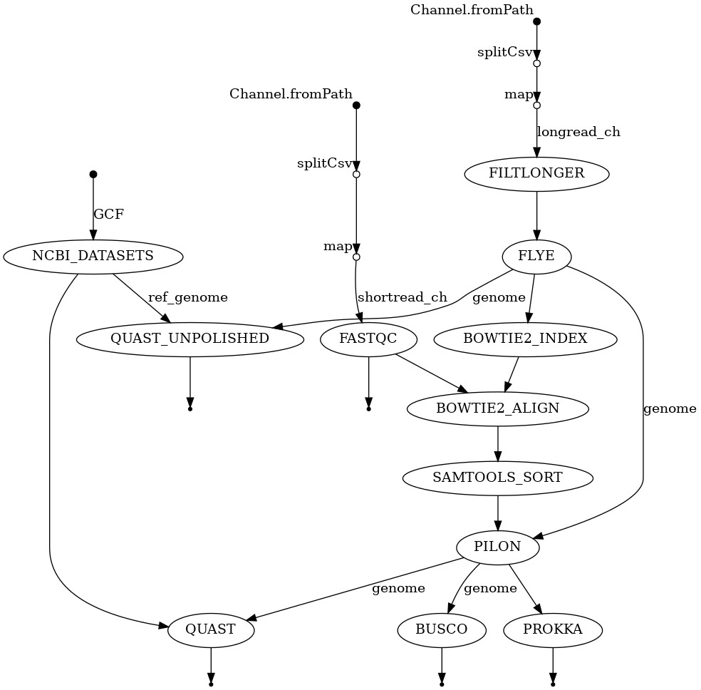
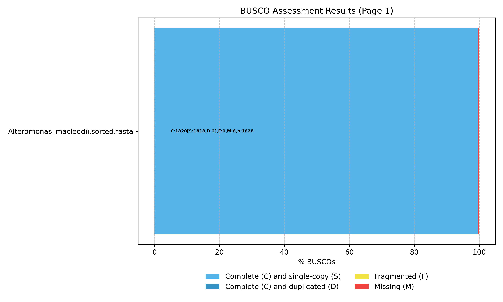
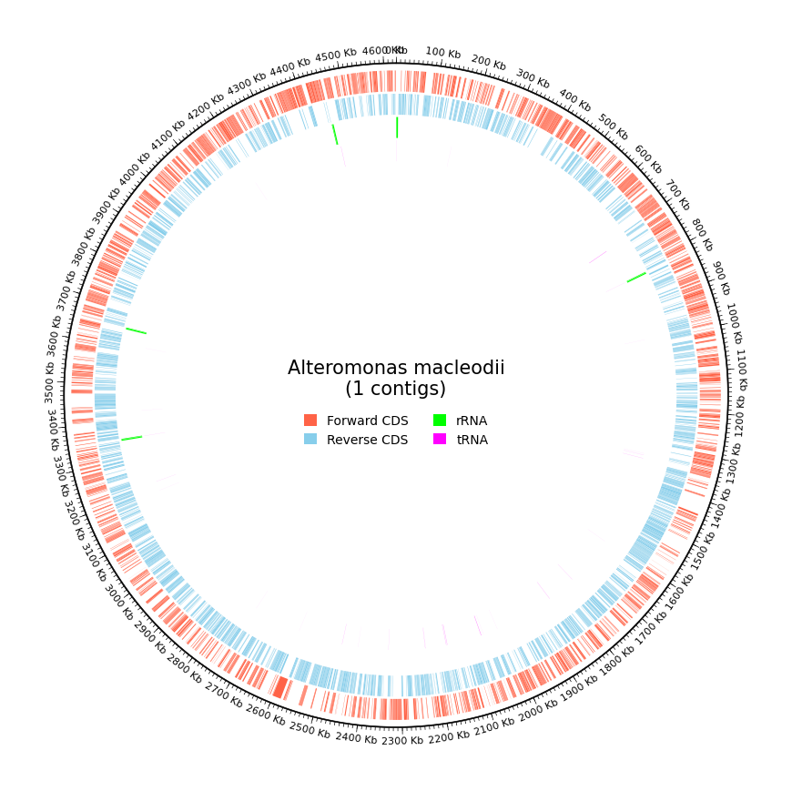

# Genome Assembly and Evaluation Pipeline
## Overview
Implemented a modular Nextflow DSL2 genome assembly pipeline for hybrid bacterial genome assembly using long- and short-read sequencing data.

The workflow performs read QC, long-read filtering, de novo assembly, short-read polishing, assembly evaluation, and functional annotation.

## Biological Question
Can high-quality bacterial genome assemblies be generated using long-read assembly followed by short-read polishing, and how does polishing improve assembly completeness and accuracy?

## Dataset
Organism: Alteromonas macleodii
Long reads: Oxford Nanopore
Short reads: Illumina paired-end
Reference genome: Downloaded via NCBI Datasets CLI

## Workflow

FASTQC → Filtlong → Flye Assembly →
Bowtie2 Indexing → Bowtie2 Alignment →
Samtools Sorting → Pilon Polishing →
BUSCO Completeness → QUAST Evaluation →
Prokka Annotation → BUSCO Plot Visualization

Implemented using modular Nextflow processes.

## Quality Control
- Long reads filtered for quality and length
- Short reads passed FastQC thresholds
- Alignment coverage sufficient for polishing
- No major GC bias detected

## Key Results
### Assembly Improvement
Polishing with Pilon:
- Reduced mismatches and indels
- Improved contiguity metrics
- Increased BUSCO completeness

### BUSCO Analysis

- Higher completeness after polishing
- Reduced fragmented and missing orthologs

### QUAST Evaluation
- Compared polished vs unpolished assemblies:
- Improved N50
- Fewer misassemblies
- Better agreement with reference genome

### Annotation

Prokka identified coding sequences, rRNAs, and tRNAs, producing a functionally annotated assembly.

## Technical Highlights
- Hybrid assembly (long + short reads)
- Automated polishing workflow
- Comparative evaluation (polished vs unpolished)
- Reference retrieval via NCBI CLI
- Quality visualization (BUSCO plots)
- Fully modular Nextflow DSL2 structure

## Tools Used
- FastQC
- Filtlong
- Flye
- Bowtie2
- Samtools
- Pilon
- BUSCO
- QUAST
- Prokka
- NCBI Datasets CLI
- Nextflow